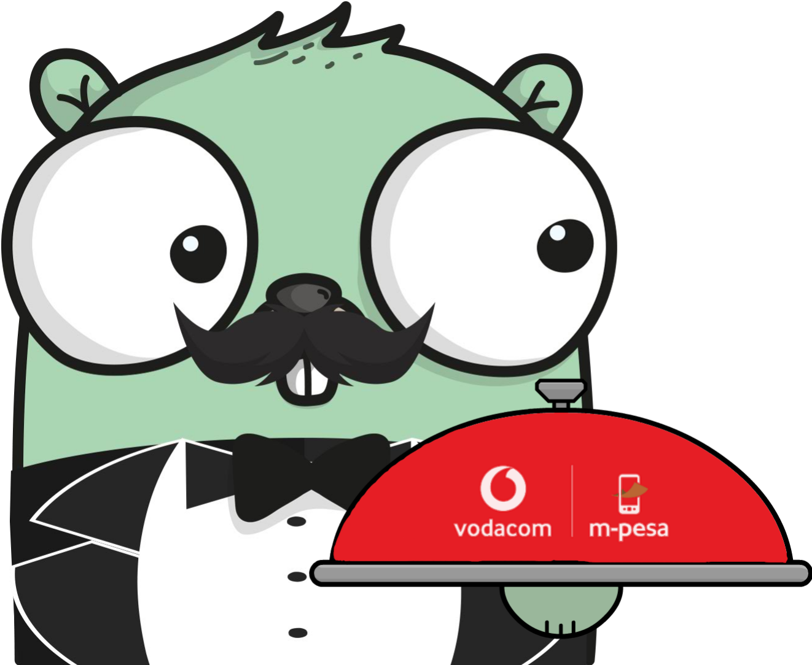

# Mpesa



[](https://go.dev/)
[](https://github.com/Golang-Tanzania/Mpesa)
[](https://pkg.go.dev/github.com/Golang-Tanzania/mpesa)

Golang bindings for the [Mpesa Payment API](openapiportal.m-pesa.com/). Make your MPESA payments _Ready... To... Gooo!_ (_pun intended_). Made with love for gophers.

## Features

- [x] Customer to Business (C2B) Single Payment
- [x] Business to Business (B2B)
- [x] Business to Customer (B2C)
- [x] Payment Reversal
- [x] Query Transaction status
- [x] Query Beneficiary Name
- [x] Query Direct Debit
- [x] Direct Debit Create
- [x] Direct Debit Payment

## Pre-requisites

- First sign up with [Mpesa](https://openapiportal.m-pesa.com/sign-up) to get your API Key and PUBLIC key. 

    You can go through this blog, [Getting Started With Mpesa Developer API](https://dev.to/alphaolomi/getting-started-with-mpesa-developer-portal-46a4) for a more detailed guide.

- API key and Public key can be put in a file the following extensions `json, yaml, .env`

Supported extensions

json
 ```
  {
      "api_key":"your-api-key",
      "public_key":"your-public-key"
  }
  ```

yaml
```yaml
api_key: your-api-key
public_key: your public key
```
.env
```
api_key=your-api-key
public_key=your-public-key

```

## Installation

Simply install with the `go get` command:

```sh
go get github.com/Golang-Tanzania/mpesa
```

Then import it to your main package as:

```go
package main

import (
	mpesa "github.com/Golang-Tanzania/mpesa
)
```

## Load keys

First create a new variable of type `mpesa.Client` and then load the configs that we put on config dir, in it there is config.json file

```go
var client mpesa.Client

client.LoadKeys("path to dir", "file", "file extension(json,yaml,.env)", environment(mpesa.Sandbox/mpesa.Production))
client.LoadKeys("./config", "config", "json", mpesa.Sandbox)
```

## Examples

Below are examples on how to make different transactions.

### Customer To Business

```go
package main

import (
	"context"
	"fmt"
	"net/http"
	"time"

	"github.com/Golang-Tanzania/mpesa"
)

func main() {
	var client mpesa.Client

	client.LoadKeys("./config", "config", "json", mpesa.Sandbox)

	customClient := &http.Client{
		Timeout: 10 * time.Second,
	}
	client.SetHttpClient(customClient)

	a := mpesa.C2BPaymentRequest{
		InputAmount:                   "100",
		InputCustomerMSISDN:           "000000000001",
		InputCountry:                  "TZN",
		InputCurrency:                 "TZS",
		InputServiceProviderCode:      "000000",
		InputTransactionReference:     "T12344C",
		InputThirdPartyConversationID: "asv02e5958774f7ba228d83d0d689761",
		InputPurchasedItemsDesc:       "Test",
	}
	res, err := client.C2BPayment(context.Background(), a)

	if err != nil {
		fmt.Println(err)
	}

	fmt.Println("res", res)
}
```

### Business To Customer

```go
package main

import (
	"context"
	"fmt"
	"net/http"
	"time"

	"github.com/Golang-Tanzania/mpesa"
)

func main() {
	var client mpesa.Client

	client.LoadKeys("./config", "config", "json", mpesa.Sandbox)

	customClient := &http.Client{
		Timeout: 10 * time.Second,
	}
	client.SetHttpClient(customClient)


	c := mpesa.B2CPaymentRequest{
		InputAmount:                   "100",
		InputCustomerMSISDN:           "000000000001",
		InputCountry:                  "TZN",
		InputCurrency:                 "TZS",
		InputServiceProviderCode:      "000000",
		InputTransactionReference:     "T12344C",
		InputThirdPartyConversationID: "asv02e5958774f7ba228d83d0d689761",
		InputPaymentItemsDesc:       "Test",
	}

	res, err := client.B2CPayment(context.Background(), c)

	if err != nil {
		fmt.Println(err)
	}

	fmt.Println("res", res)

}

```

### Business To Business

```go
package main

import (
	"context"
	"fmt"
	"net/http"
	"time"

	"github.com/Golang-Tanzania/mpesa"
)

func main() {
	var client mpesa.Client

	client.LoadKeys("./config", "config", "json", mpesa.Sandbox)

	customClient := &http.Client{
		Timeout: 10 * time.Second,
	}
	client.SetHttpClient(customClient)

	b := mpesa.B2BPaymentRequest{
		InputAmount:            "100",
		InputCountry:           "TZN",
		InputCurrency:          "TZS",
		InputPrimaryPartyCode: "000000",
		InputReceiverPartyCode: "000001",
		InputThirdPartyConversationID: "8a89835c71f15e99396",
		InputTransactionReference: "T12344C",
		InputPurchasedItemsDesc: "Test",
	}

	res, err := client.B2BPayment(context.Background(), b)

	if err != nil {
		fmt.Println(err)
	}

	fmt.Println("res", res)
}
```

### Payment Reversal

```go
package main

import (
	"context"
	"fmt"
	"net/http"
	"time"

	"github.com/Golang-Tanzania/mpesa"
)

func main() {
	var client mpesa.Client

	client.LoadKeys("./config", "config", "json", mpesa.Sandbox)

	customClient := &http.Client{
		Timeout: 10 * time.Second,
	}
	client.SetHttpClient(customClient)

	d :=  mpesa.ReversalRequest{
		InputTransactionID: "0000000000001",
		InputCountry: "TZN",
		InputServiceProviderCode: "000000",
		InputReversalAmount: "100",
		InputThirdPartyConversationID: "asv02e5958774f7ba228d83d0d689761",
	}

	res, err := client.Reversal(context.Background(), d)

	if err != nil {
		fmt.Println(err)
	}

	fmt.Println("res", res)
}
```

### Query Transaction status

```go
package main

import (
	"context"
	"fmt"
	"net/http"
	"time"

	"github.com/Golang-Tanzania/mpesa"
)

func main() {
	var client mpesa.Client

	client.LoadKeys("./config", "config", "json", mpesa.Sandbox)

	customClient := &http.Client{
		Timeout: 10 * time.Second,
	}
	client.SetHttpClient(customClient)

	e := mpesa.QueryTxStatusRequest{
		InputQueryReference:           "000000000000000000001",
		InputCountry:                  "TZN",
		InputServiceProviderCode:      "000000",
		InputThirdPartyConversationID: "asv02e5958774f7ba228d83d0d689761",
	}

	res, err := client.QueryTxStatus(context.Background(), e)

	if err != nil {
		fmt.Println(err)
	}

	fmt.Println("res", res)
}
```

### Query Beneficiary Name

```go
package main

import (
	"context"
	"fmt"
	"net/http"
	"time"

	"github.com/Golang-Tanzania/mpesa"
)

func main() {
	var client mpesa.Client

	client.LoadKeys("./config", "config", "json", mpesa.Sandbox)

	customClient := &http.Client{
		Timeout: 10 * time.Second,
	}
	client.SetHttpClient(customClient)

	h := mpesa.QueryBenRequest{
		InputCountry:                  "TZN",
		InputServiceProviderCode:      "000000",
		InputThirdPartyConversationID: "AAA6d1f939c1005v2de053v4912jbasdj1j2kk",
		InputCustomerMSISDN:           "000000000001",
		InputKycQueryType:             "Name",
	}

	res, err := client.QueryBeneficiaryName(context.Background(), h)

	if err != nil {
		fmt.Println(err)
	}

	fmt.Println("res", res)
}
```

### Query Direct Debit

```go

	i := mpesa.QueryDirectDBReq{
		InputQueryBalanceAmount:       true,
		InputBalanceAmount:            "100",
		InputCountry:                  "TZN",
		InputCustomerMSISDN:           "255744553111",
		InputMsisdnToken:              "cvgwUBZ3lAO9ivwhWAFeng==",
		InputServiceProviderCode:      "112244",
		InputThirdPartyConversationID: "GPO3051656128",
		InputThirdPartyReference:      "Test123",
		InputMandateID:                "15045",
		InputCurrency:                 "TZS",
	}

	res, err := client.QueryDirectDebit(context.Background(), i)

	if err != nil {
		fmt.Println(err)
	}

	fmt.Println("res", res)
}
```

### Direct Debit Create

```go
package main

import (
	"context"
	"fmt"
	"net/http"
	"time"

	"github.com/Golang-Tanzania/mpesa"
)

func main() {
	var client mpesa.Client

	client.LoadKeys("./config", "config", "json", mpesa.Sandbox)

	customClient := &http.Client{
		Timeout: 10 * time.Second,
	}
	client.SetHttpClient(customClient)


	f := mpesa.DirectDebitRequest{
		InputCustomerMSISDN:         "000000000001",
		InputCountry:                "TZN",
		InputServiceProviderCode:    "000000",
		InputThirdPartyReference:    "3333",
		InputThirdPartyConversationID: "asv02e5958774f7ba228d83d0d689761",
		InputAgreedTC:               "1",
		InputFirstPaymentDate:       "20160324",
		InputFrequency:              "06",
		InputStartRangeOfDays:       "01",
		InputEndRangeOfDays:         "22",
		InputExpiryDate:             "20161126",
	}

	res, err := client.DirectDebitCreate(context.Background(), f)

	if err != nil {
		fmt.Println(err)
	}

	fmt.Println("res", res)
}
```

### Direct Debit Payment

```go
package main

import (
	"context"
	"fmt"
	"net/http"
	"time"

	"github.com/Golang-Tanzania/mpesa"
)

func main() {
	var client mpesa.Client

	client.LoadKeys("./config", "config", "json", mpesa.Sandbox)

	customClient := &http.Client{
		Timeout: 10 * time.Second,
	}
	client.SetHttpClient(customClient)


	g := mpesa.DebitDBPaymentReq{
		InputMsisdnToken:              "AbCd123=",
		InputCustomerMSISDN:           "000000000001",
		InputCountry:                  "TZN",
		InputServiceProviderCode:      "000000",
		InputThirdPartyReference:      "5db410b459bd433ca8e5",
		InputThirdPartyConversationID: "AAA6d1f939c1005v2de053v4912jbasdj1j2kk",
		InputAmount:                   "10",
		InputCurrency:                 "TZS",
		InputMandateID:                "15045",
	}

	res, err := client.DirectDebitPayment(context.Background(), g)

	if err != nil {
		fmt.Println(err)
	}

	fmt.Println("res", res)
}
```

### Cancel Direct Debit 
```go
package main

import (
	"context"
	"fmt"
	"net/http"
	"time"

	"github.com/Golang-Tanzania/mpesa"
)

func main() {
	var client mpesa.Client

	client.LoadKeys("./config", "config", "json", mpesa.Sandbox)

	customClient := &http.Client{
		Timeout: 10 * time.Second,
	}
	client.SetHttpClient(customClient)


	j := mpesa.CancelDirectDBReq{
		InputMsisdnToken:              "cvgwUBZ3lAO9ivwhWAFeng==",
		InputCustomerMSISDN:           "000000000001",
		InputCountry:                  "TZN",
		InputServiceProviderCode:      "000000",
		InputThirdPartyReference:      "00000000000000000001",
		InputThirdPartyConversationID: "AAA6d1f939c1005v2de053v4912jbasdj1j2kk",
		InputMandateID:                "15045",
	}

	res, err := client.CancelDirectDebit(context.Background(), j)

	if err != nil {
		fmt.Println(err)
	}

	fmt.Println("res", res)
}

```

## Authors

This package is authored and maintained by [Mojo](https://github.com/AvicennaJr) and [Hopertz](https://github.com/Hopertz).
A list of all other contributors can be found [here](https://github.com/Golang-Tanzania/mpesa/graphs/contributors).

## Contributing

Contributions are welcome. Please open an issue or submit a pull request.


## License

MIT License

Copyright (c) 2023 Golang Tanzania
